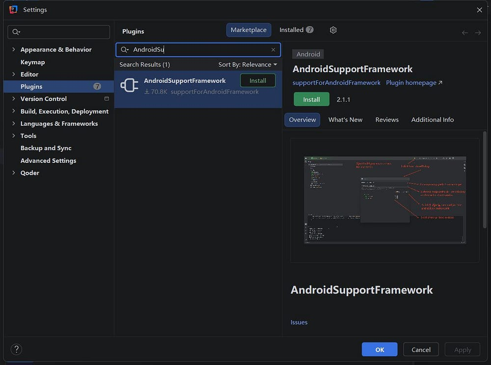
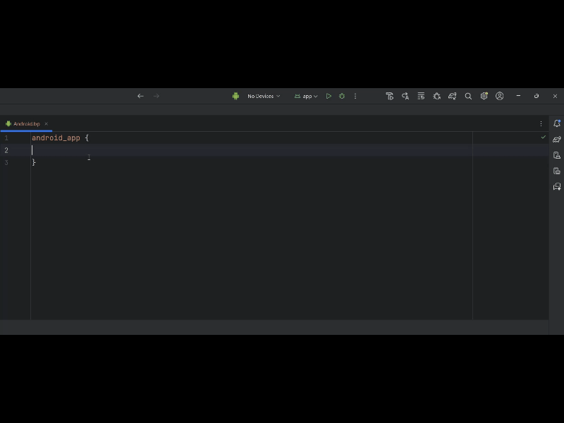
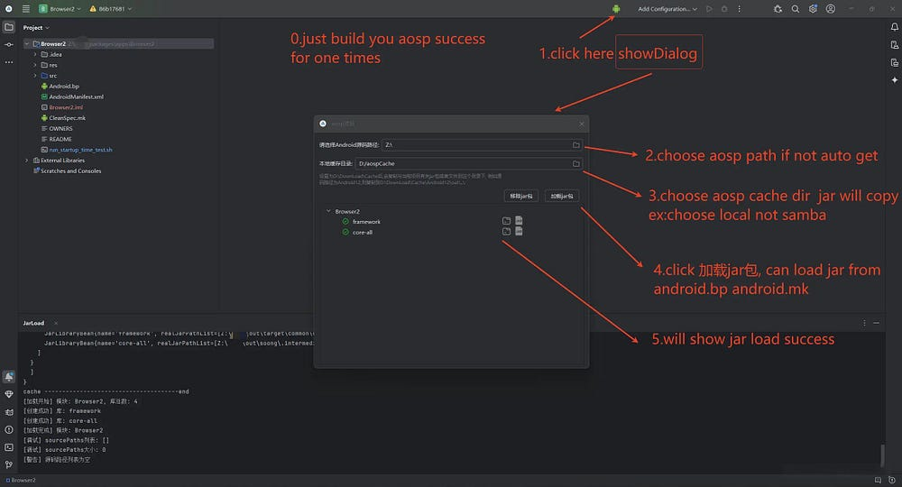
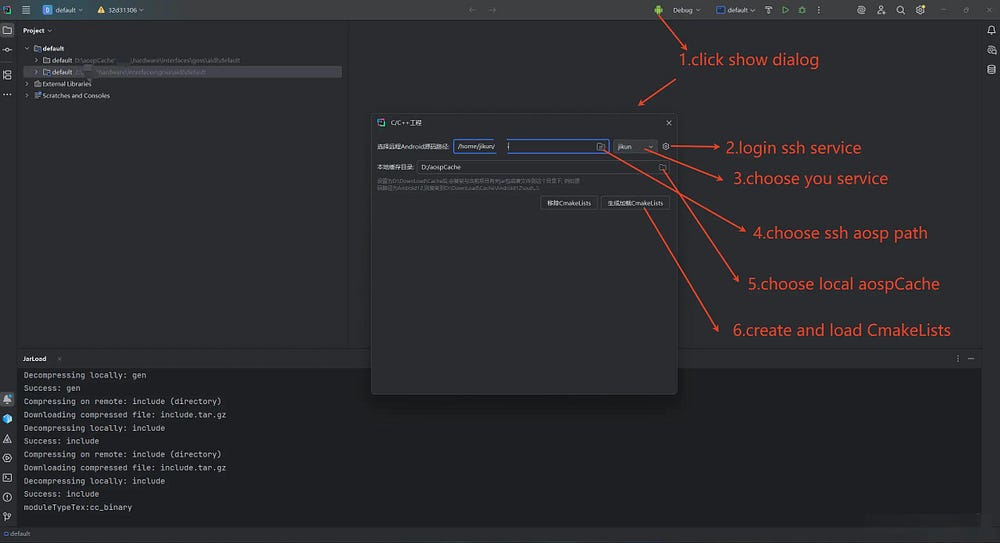

# AOSP 源码开发辅助工具-AndroidSupportFramework
[English README.md/ English](README_EN.md)
## 前言

从安卓应用开发转行做系统开发后，用 Android Studio 编写 Framework 代码总觉得很不习惯。不仅没有智能代码提示，也无法直接跳转源码，查阅代码逻辑只能手动检索，VS Code 也存在同样的问题，整体开发效率偏低。

于是我萌生了想法，打算做一款工具，实现 IDE 一键导入 Jar 包和头文件的功能，以此改善开发体验。断断续续开发打磨三年多，插件累计收获七万余次下载，今天就正式把这款插件详细介绍给大家。

## 优点

支持java和C/C++工程,加载jar包只需要1到2分钟左右,加载c++工程大概3-4分钟左右
无需忍受idegen加载过慢的问题

## 介绍AndroidSupportFramework

AndroidSupportFramework可以在AndroidStudio,Clion,IntelliJ IDEA Community(until 2025.2)中的Plugins中下载。

## 功能

### 插件支持Android.mk和Android.bp的语法提示和高亮

### java项目 插件支持一键加载jar包

> 这个功能需要提前编译成功一次源码

> AndroidStudio或IntelliJ IDEA Community中使用

### C/C++工程 插件支持一键生成CmakeLists.txt文件,自动Load CmakeLists.txt

> 这个功能需要提前编译成功一次源码

> 只能在CLION中使用 现在Clion对于个人用户是完全免费的

然后你就可以随便跳转代码和查看代码。

